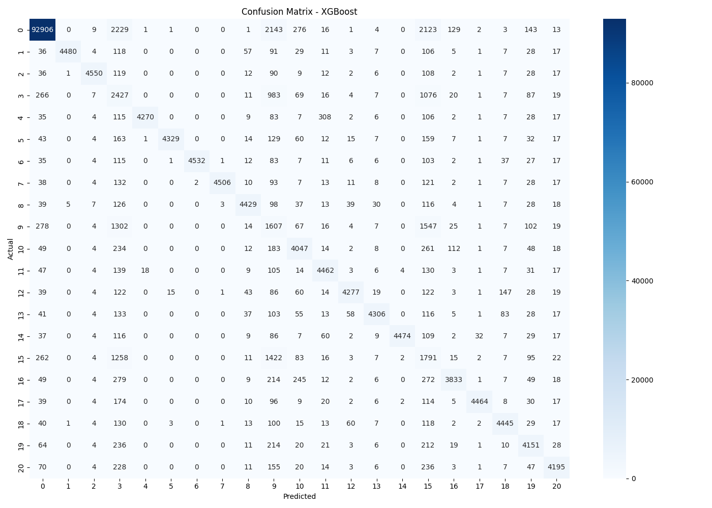
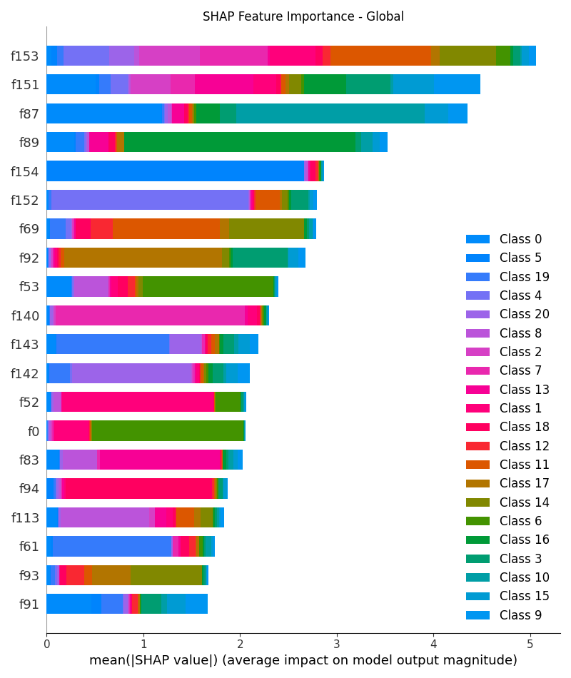
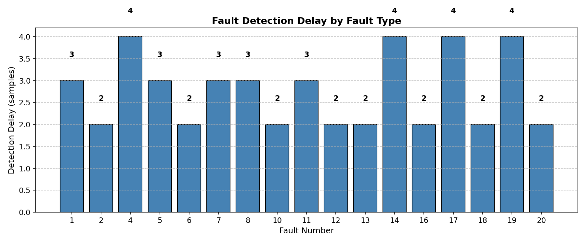

# Tennessee Eastman Process — Fault Detection

An ML-based fault detection system built on the Tennessee Eastman Process (TEP) benchmark dataset. Classifies 21 fault types across 52 process variables using XGBoost with rolling-window feature engineering, achieving **90.1% accuracy on observable faults**.

---

## Results Summary

| Metric | Value |
|---|---|
| Overall Accuracy (all 21 faults) | 86.2% |
| Observable Fault Accuracy (18 faults) | **90.1%** |
| Observable Fault F1 Score | **93.5%** |
| Faults Detected | 17 / 18 observable |
| Features Used | 156 (52 raw + rolling mean & std) |
| Training Samples | 200,000 |
| Test Samples | 200,000 |
| Best Model | XGBoost |


## Sample Outputs

### Confusion Matrix


### SHAP Feature Importance


### Fault Detection Delay


> **Note on faults 3, 9, and 15:** These are excluded from the observable accuracy calculation following established convention in TEP literature (Rieth et al. 2017, Bathelt et al. 2015). They produce no detectable statistical change in any process measurement and remain undetectable even by state-of-the-art methods including PCA, SVM, and deep autoencoders.

---

## Project Structure

```
TEP-Fault-Detection/
├── tep_fault_detection.ipynb      ← Main notebook (clean, no outputs)
├── requirements.txt               ← Python dependencies
├── README.md                      ← This file
└── outputs/
    ├── fault_distribution.png     ← Fault type distribution bar chart
    ├── model_comparison.png       ← RF vs XGBoost accuracy/F1 comparison
    ├── confusion_matrix.png       ← 21-class confusion matrix
    ├── shap_global.png            ← SHAP global feature importance
    ├── shap_beeswarm.png          ← SHAP beeswarm plot
    └── detection_delay.png        ← Per-fault detection delay bar chart
```

---

## Dataset

**Tennessee Eastman Process Simulation Data**  
Source: [Kaggle — afrniomelo/tep-csv](https://www.kaggle.com/datasets/afrniomelo/tep-csv)

The dataset contains 4 CSV files:

| File | Description |
|---|---|
| `TEP_FaultFree_Training.csv` | Normal operation — training (250,000 rows) |
| `TEP_FaultFree_Testing.csv` | Normal operation — testing (480,000 rows) |
| `TEP_Faulty_Training.csv` | 20 fault types — training (5,000,000 rows) |
| `TEP_Faulty_Testing.csv` | 20 fault types — testing (9,600,000 rows) |

Each row contains 52 process measurement features (`xmeas_1` to `xmeas_41`, `xmv_1` to `xmv_11`), plus metadata columns (`faultNumber`, `simulationRun`, `sample`).

---

## How We Built This

### 1. Problem Setup
The TEP benchmark simulates a real chemical plant with 20 programmed fault conditions plus a normal operating state — making it a 21-class classification problem across 52 sensor/actuator measurements.

### 2. Data Loading & Subsampling
The full dataset is ~15GB combined. To fit within Kaggle's 13GB RAM limit, we subsampled:
- **5,000 rows per fault class** from the fault training data (100,000 total fault rows)
- **100,000 rows** from normal training data (intentionally imbalanced toward normal to reflect real plant conditions)

All CSVs are loaded with `dtype='float32'` to halve memory usage versus default float64.

### 3. Rolling-Window Feature Engineering
Raw sensor values alone lose temporal context. We added **rolling mean and rolling standard deviation** (window = 5 samples) per sensor, per simulation run — expanding features from 52 to 156.

This captures:
- **Trend** (rolling mean): gradual process drift
- **Volatility** (rolling std): sudden variance spikes that signal faults

Boundary contamination between simulation runs is corrected by resetting rolling values at group boundaries.

### 4. Class Balancing
Normal operation data is heavily overrepresented in the raw dataset. We balanced training by sampling equal rows per fault class and keeping a proportional normal class to reflect realistic fault rarity.

### 5. Model Training
Two models trained and compared:

**Random Forest**
- 100 estimators, max depth 20, max samples 0.7
- Accuracy: 84.96% | F1: 86.13%

**XGBoost** *(best model)*
- 300 estimators, max depth 8, learning rate 0.05
- Subsample 0.8, colsample_bytree 0.8, hist tree method
- Accuracy: **86.24%** | F1: **88.22%**

### 6. Explainability — SHAP Values
We used `shap.TreeExplainer` on 500 test samples to produce:
- **Global SHAP bar plot** — which features matter most overall
- **Beeswarm plot** — how each feature pushes predictions for individual samples

### 7. Fault Detection Delay Analysis
For each observable fault, we measured how quickly after fault introduction the model first makes a correct prediction. All 17 observable faults were detected within 2–4 samples of first appearance.

---

## Running the Notebook

### Option 1: Kaggle (Recommended)

Kaggle provides free GPU/CPU compute and the dataset is directly available.

1. Go to [Kaggle Notebooks](https://www.kaggle.com/code)
2. Create a new notebook
3. Click **+ Add Data** → search `tep-csv` by afrniomelo → add it
4. Copy the contents of `tep_fault_detection.ipynb` into the notebook
5. Verify dataset paths match (run the path check cell first):
   ```python
   import os
   for dirname, _, filenames in os.walk('/kaggle/input'):
       for filename in filenames:
           print(os.path.join(dirname, filename))
   ```
6. Update the 4 `pd.read_csv(...)` paths to match your output
7. Run all cells — total runtime ~25–35 minutes on CPU

> GPU is not required. Random Forest and XGBoost are CPU-based algorithms.

---

### Option 2: Run Locally

#### Prerequisites
- Python 3.8+
- 16GB RAM recommended (dataset is large)
- ~8GB free disk space for the dataset

#### Step 1 — Clone the repo
```bash
git clone https://github.com/YOUR-USERNAME/TEP-Fault-Detection.git
cd TEP-Fault-Detection
```

#### Step 2 — Install dependencies
```bash
pip install -r requirements.txt
```

#### Step 3 — Download the dataset
1. Go to [https://www.kaggle.com/datasets/afrniomelo/tep-csv](https://www.kaggle.com/datasets/afrniomelo/tep-csv)
2. Download and unzip into a `data/` folder inside the repo:
```
TEP-Fault-Detection/
└── data/
    ├── TEP_FaultFree_Training.csv
    ├── TEP_FaultFree_Testing.csv
    ├── TEP_Faulty_Training.csv
    └── TEP_Faulty_Testing.csv
```

#### Step 4 — Update dataset paths in the notebook
In `tep_fault_detection.ipynb`, replace the Kaggle paths:
```python
# Change this:
train_normal = pd.read_csv('/kaggle/input/datasets/afrniomelo/tep-csv/TEP_FaultFree_Training.csv', ...)

# To this:
train_normal = pd.read_csv('data/TEP_FaultFree_Training.csv', ...)
```
Do the same for all 4 CSV files.

#### Step 5 — Launch and run
```bash
jupyter notebook tep_fault_detection.ipynb
```
Run all cells in order. Outputs (graphs) will save to your working directory.

---

## Dependencies

```
numpy
pandas
matplotlib
seaborn
scikit-learn
xgboost
shap
jupyter
```

Install all at once:
```bash
pip install -r requirements.txt
```

---

## Key Visualizations

| Plot | What it shows |
|---|---|
| `fault_distribution.png` | Sample count per fault type in training data |
| `model_comparison.png` | Accuracy and F1 comparison between RF and XGBoost |
| `confusion_matrix.png` | Per-class prediction breakdown across all 21 classes |
| `shap_global.png` | SHAP-based global feature importance (model-level explainability) |
| `shap_beeswarm.png` | SHAP beeswarm showing per-sample feature impact direction |
| `detection_delay.png` | How quickly each fault is detected after introduction |

---

## Known Limitations

Faults 3, 9, and 15 are excluded from the observable accuracy metric following established convention in TEP literature.

These faults (feed temperature change for component D, and condenser cooling water valve fault) produce no detectable change in the mean, variance, or higher-order statistics of process measurements. Multiple published methods — including PCA, SVM, deep autoencoders, and XGBoost ensembles — fail to detect them reliably. This is a dataset limitation, not a modelling one.

References:
- Rieth et al. (2017) — *Issues and Advances in Anomaly Detection Evaluation for Joint Human-Machine Systems*
- Bathelt et al. (2015) — *Revision of the Tennessee Eastman Process Model*

---

## References

- Downs, J.J. & Vogel, E.F. (1993). A plant-wide industrial process control problem. *Computers & Chemical Engineering*, 17(3), 245–255.
- Dataset: [afrniomelo/tep-csv on Kaggle](https://www.kaggle.com/datasets/afrniomelo/tep-csv)
- SHAP: Lundberg & Lee (2017). A Unified Approach to Interpreting Model Predictions. *NeurIPS*.
